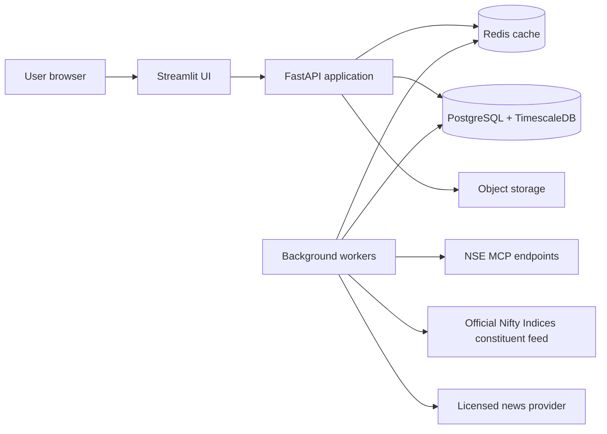

# paisaan production backend plan

## 1. Goal and boundary

`paisaan` is a CapitalSense Advisors market-research product, not an order-execution system. The production backend should serve a verified Nifty 200 universe, current/EOD market snapshots, historical OHLCV, precomputed technical indicators, saved screens, watchlists, and ticker-tagged news.

The Streamlit application remains the presentation layer. It must **never** call NSE MCP endpoints directly in production. All supplier calls, rate limiting, normalization, caching, and audit metadata live in the backend.

## 2. Recommended architecture



### Deployment units

| Unit | Technology | Responsibility |
|---|---|---|
| UI | Streamlit | Screens, filters, tables, charts, session presentation only |
| API | FastAPI | Authz, API contracts, cached reads, exports, watchlist/screener CRUD |
| Worker | Celery or Dramatiq | Scheduled ingestion, retries, indicator calculation, news tagging |
| Scheduler | Celery Beat or cloud scheduler | Market calendar-aware jobs |
| Database | PostgreSQL + TimescaleDB | Users, universe, bars, indicators, saved objects, audit records |
| Cache/queue | Redis | Request cache, distributed locks, worker queue, rate limits |
| Storage | S3-compatible bucket | Raw source payloads, failed-payload quarantine, export files |

## 3. Data sources and source-of-truth rules

| Data | Source | Use |
|---|---|---|
| Nifty 200 membership | Official NSE Indices constituent CSV | Daily universe refresh; versioned membership history |
| Current/EOD prices and OHLCV | NSE MCP CM/Bhavcopy tools | Quotes, history, market breadth |
| Corporate actions | NSE MCP | Adjustment-factor pipeline and audit trail |
| Index snapshots/history | NSE MCP | Benchmark metrics and comparisons |
| News | Licensed API/RSS sources with permitted usage | Ticker-tagged feed only after legal review |

Never assume `limit=200` from an exchange endpoint means Nifty 200. Resolve the current official constituent list first, then query only those symbols.

## 4. Core data model

### Reference and audit tables

- `instruments(id, symbol, isin, company_name, industry, series, active)`
- `index_definitions(id, code, name)`
- `index_memberships(index_id, instrument_id, effective_from, effective_to, source_url, source_hash)`
- `data_sources(id, name, endpoint, terms_version)`
- `ingestion_runs(id, job_name, started_at, completed_at, status, source_id, row_count, error)`
- `raw_payloads(id, ingestion_run_id, object_key, checksum, fetched_at)`

### Market data and analytics tables

- `daily_bars(instrument_id, trading_date, open, high, low, close, volume, turnover, adjusted_close, source_run_id)`
- `index_daily_bars(index_id, trading_date, open, high, low, close, pe, pb, source_run_id)`
- `technical_snapshots(instrument_id, trading_date, sma20, sma50, sma100, sma200, ema20, rsi14, atr14_pct, vol20, vol1y, maxdd1y, return_1w, return_1m, return_3m, return_6m, return_1y, return_3y_cagr, rel_strength_6m, above_ma_count, volume_ratio_20d, new_52w_high, new_52w_low, golden_cross_20d, death_cross_20d)`
- `sector_daily_metrics(index_id, industry, trading_date, members, advancers, decliners, avg_return, turnover)`
- `market_signals(id, instrument_id, trading_date, signal_type, direction, value, reference_value, payload)`

### Product tables

- `users(id, auth_subject, email, display_name, created_at)`
- `watchlists(id, user_id, name, created_at, updated_at)`
- `watchlist_items(watchlist_id, instrument_id, created_at)`
- `saved_screens(id, user_id, name, expression, columns, sort, created_at)`
- `news_articles(id, provider, provider_id, published_at, url, headline, summary, raw_payload)`
- `news_tags(article_id, instrument_id, confidence, method)`

Make `(instrument_id, trading_date)` unique on daily bars and technical snapshots. Retain raw payload hashes so every displayed number can be traced to an ingestion run.

## 5. Ingestion and computation pipeline

### Market-calendar aware jobs

1. **06:30 IST daily:** download the official constituent file, validate schema, create/close membership intervals, and alert on additions/removals.
2. **Market hours:** poll/cache the permitted quote source at a rate compatible with its terms. Publish only snapshots that pass schema and freshness checks.
3. **After market close:** ingest the daily Bhavcopy bars, reconcile count and close values, then upsert daily bars.
4. **After successful bar ingestion:** calculate technical snapshots for only the changed symbols; refresh index and sector aggregates.
5. **After corporate-action ingestion:** calculate adjustment factors, rebuild affected adjusted bars and indicators, and mark affected exports with the correction timestamp.
6. **News every 10-15 minutes:** ingest permitted feeds, deduplicate by canonical URL/headline similarity, tag symbols using deterministic symbol/company matching followed by confidence scoring.

### Reliability requirements

- Idempotency key: `source + market_date + instrument + payload_hash`.
- Retries with exponential backoff; do not fan out repeatedly during supplier errors.
- Redis distributed lock for every scheduled task.
- Dead-letter queue plus alerting for failed jobs.
- Freshness fields returned with every API response: `as_of`, `source`, `ingested_at`, `is_stale`.
- Reconciliation dashboard: expected vs received constituents, bars, quotes, and indicator rows.

## 6. API contract

Version every endpoint under `/v1`. Serve JSON, use cursor pagination, and return an `as_of` timestamp with market results.

| Endpoint | Purpose |
|---|---|
| `GET /v1/market/overview?index=NIFTY200` | Index metrics, breadth, sector summary, top movers, freshness |
| `GET /v1/universes/NIFTY200/constituents` | Official current membership and metadata |
| `GET /v1/stocks/{symbol}/quote` | Price summary, day/52-week ranges, stats and latest signals |
| `GET /v1/stocks/{symbol}/bars?range=1Y&resolution=1D` | Pre-aggregated OHLCV for charts |
| `GET /v1/stocks/{symbol}/technicals` | SMA, RSI, volume and return metrics |
| `GET /v1/heatmap?index=NIFTY200` | Treemap payload: industry, turnover, daily change |
| `GET /v1/sectors?index=NIFTY200` | Sector analytics and breadth |
| `GET /v1/signals?index=NIFTY200&type=bullish` | Rule-engine events |
| `POST /v1/screens/evaluate` | Safe screener AST + filters; no raw SQL or Python evaluation |
| `GET /v1/news?symbol=RELIANCE` | Tagged articles with source attribution |
| `GET/POST /v1/watchlists` | User-owned watchlists |
| `POST /v1/exports/screener` | Asynchronous CSV export with signed download URL |

## 7. Safe screener design

Do not `eval()` user-entered expressions. Build a small parser that converts a permitted grammar into parameterized SQL/SQLAlchemy expressions.

```text
expression  := or_expression
or_expression := and_expression ("or" and_expression)*
and_expression := comparison ("and" comparison)*
comparison := field operator value | "(" expression ")"
field := close | sma50 | sma200 | rsi14 | volume_ratio_20d | industry | ...
operator := > | >= | < | <= | == | !=
```

- Whitelist every field and operator.
- Enforce expression depth, token count, selected universe, and query time limits.
- Compile against the latest completed `technical_snapshots` date.
- Provide saved templates as server-owned JSON expressions, not client-side string snippets.

## 8. Authentication and authorization

Use a managed OIDC provider such as Supabase Auth, Auth0, or Clerk. Streamlit receives a short-lived session token and sends it to FastAPI; FastAPI validates JWTs and owns authorization.

- Anonymous users: public market overview and delayed/EOD data only.
- Authenticated users: private watchlists, saved screens, CSV exports.
- Admins: data-quality controls and source/job visibility.
- Row-level access: every watchlist/saved screen query includes `user_id`.
- Do not store provider keys or access tokens in the Streamlit repository. Use secret manager references in deployment.

## 9. Performance and scaling targets

| Surface | Target | Design choice |
|---|---|---|
| Dashboard read | p95 under 500 ms from warm cache | Precomputed overview JSON in Redis |
| Screener evaluation | p95 under 1.5 s for 200 symbols | Indexed technical snapshot table |
| Chart request | p95 under 750 ms | Pre-aggregated daily/weekly/monthly bars |
| First Streamlit page | under 3 s excluding cold start | One overview request, no direct MCP calls |
| Data refresh | visible with age label | Background worker only |

For a 200-stock universe, PostgreSQL is sufficient. TimescaleDB helps retention, compression, and time-series queries; a separate warehouse is not necessary initially.

## 10. Streamlit responsibilities and limits

Streamlit is appropriate for authenticated research screens, tables, forms, filters, exports, cached API reads, and dashboard composition. Keep it stateless: it should not calculate indicators or hold source data.

For the specification's high-performance charting, use a Streamlit custom component wrapping TradingView Lightweight Charts. The component calls FastAPI for already-aggregated bars. Streamlit alone is not the right place for sub-second streaming charts, a global command palette, or persistent browser-side interaction state.

## 11. Security, compliance, and operations

- Enforce HTTPS, secret-manager backed configuration, least-privilege database roles, and regular dependency scans.
- Apply API rate limits per user/IP and an upstream source rate limit per worker.
- Record provenance and freshness for every market-derived response.
- Display a market-data disclaimer and avoid recommendations/order execution.
- Confirm NSE/MCP and news-provider commercial usage terms before public deployment.
- Instrument API/worker latency, source freshness, queue depth, task failures, and error rate using OpenTelemetry plus Sentry/CloudWatch/Grafana.
- Daily database backups and tested restore drills; keep raw source payloads according to retention policy.

## 12. Delivery roadmap

### Phase 1 - reliable market-data core

1. Provision Postgres/TimescaleDB, Redis, object storage, FastAPI, worker, and secrets.
2. Implement constituent, quote, Bhavcopy and ingestion-run schemas.
3. Add daily constituent refresh and post-close OHLCV ingestion with audit records.
4. Serve a cached Nifty 200 overview and ticker bars to Streamlit.

**Exit criteria:** dashboard uses only FastAPI; zero direct MCP calls from Streamlit; source freshness and ingestion health are visible.

### Phase 2 - analytics and product primitives

1. Add adjusted history, SMA/EMA/RSI/ATR/returns/volume metrics.
2. Build sector aggregates, heatmap payloads, top-mover and signal endpoints.
3. Add chart component, detail metrics, CSV exports, and safe screener parser.

**Exit criteria:** all chart and screener calculations are backed by a completed snapshot date and are reproducible from stored data.

### Phase 3 - user product and news

1. Add OIDC authentication, watchlists, saved screens, and row-level permissions.
2. Integrate a licensed news provider and ticker-tagging pipeline.
3. Add monitoring, data quality alerts, load tests, backup/restore test, and deployment runbook.

**Exit criteria:** authenticated users can save research workflows; production monitoring and failure recovery are in place.

## 13. Initial repository layout

```text
apps/
  streamlit/             # UI only
  api/                   # FastAPI routers, schemas, auth
  worker/                # scheduled jobs and task handlers
packages/
  market_data/           # NSE adapters, normalization, validation
  analytics/             # indicators and screener AST
  contracts/             # shared Pydantic request/response models
infra/
  docker/
  terraform/
  migrations/
docs/
  runbooks/
```
